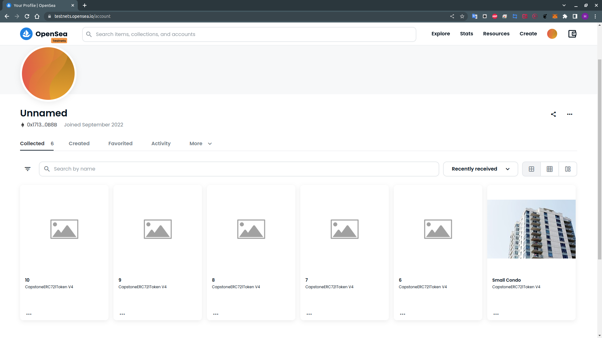

# Udacity Blockchain Capstone

## Rinkeby Contract Address:

https://goerli.etherscan.io/address/0x4656691a3e008d4bb037e711042aad3603612b0a

| Contract Name      | Contract Address                           |
| ------------------ | ------------------------------------------ |
| Migrations         | 0x3E137FB2f50AE48fd600727FF681284A8F164ec7 |
| Verifier           | 0x2FC3EC36bcD4A7685bbe0C9AEb7f81b44FdA694F |
| SolnSquareVerifier | 0x6d49a7868C37C35173DCa74337D3c7506fD88117 |

## OpenSea

https://testnets.opensea.io/collection/capstoneerc721token-v4

## Minted Token

```
0x7c4b2437760da465ca1c8521f1ced7a2090fc206af4e1b7580b3e142f58c32fc
0x688bdf729addfa4ad11f184848440eb7469896fa1106e1513c3c002c8704d0c7
0xe262286e587b5de4929660107ca348b7d47822fdd150f4d3ae5e03ec0be941f3
0x068afb53094adf5a9fef07a950a5c1eb7786f3424c3cd677e92781ad5a66a9da
0x9de757cbc225a80b300609a0efb845b8e96f04df9e48035b2683190c19916735
0xf8e3b16175d434f1014f2eaa094b5caa5d2d23f9d65de32fba973a1bea333687
0x695d569341cbf433c9d4ca653db6743840a2e123a79613f80e2bed2d32688a0b
0x956997435b0f6266c6f97787589419cb6716e1964b030fa23956b1b66878f09c
0x57aba09efdd8a36c4bb20e740697eb3b296b01ac942bfba7c7e901fe87e358e9
0x49dbd481b83ee30fc74407d4c75c0caa6efbc936f5018189ede388a45f342b0b
```

## Libraries

```bash
Truffle v5.5.28 (core: 5.5.28)
Ganache v7.4.0
Solidity - ^0.8.0 (solc-js)
Node v16.17.0
Web3.js v1.7.4
```

## Dependency

```
	"dependencies": {
		"@openzeppelin/contracts": "^4.7.3",
		"@truffle/hdwallet-provider": "^2.0.14",
		"dotenv": "^16.0.2",
		"lite-server": "^2.6.1",
		"openzeppelin-solidity": "^4.6.0",
		"solc": "^0.8.17",
		"solc-js": "^1.0.1",
		"truffle-assertions": "^0.9.2",
		"web3": "^1.7.5",
		"web3-provider-engine": "^16.0.4"
	}
```

## Run test

```
➜ npm install
➜ ganache-cli
➜ truffle compile
➜ truffle migrate --reset
➜ truffle test
```

```bash
Using network 'development'.


Compiling your contracts...
===========================
> Everything is up to date, there is nothing to compile.
⠦ Fetching solc version list from solc-bin. Attempt #1

  Contract: TestCapstoneERC721Tokenolc-bin. Attempt #1
    match erc721 spec
      ✔ should return total supplysolc-bin. Attempt #1
      ✔ should get token balancem solc-bin. Attempt #1
      ✔ should return token uriom solc-bin. Attempt #1
      ✔ should transfer token from one owner to another (67ms)
    have ownership properties
      ✔ should fail when minting when address is not contract owner
      ✔ should return contract ownerlc-bin. Attempt #1
⠼ Fetching solc version list from solc-bin. Attempt #1
  Contract: TestSolnSquareVerfier
    ✔ Test if a new solution can be addedn. Attempt #1
    ✔ Test if an ERC721 token can be minted (2258ms)#1

  Contract: TestSquareVerfier
    ✔ Test verification with correct proof (915ms)t #1
    ✔ Test verification with incorrect proof (581ms)#1


  10 passing (7s)
```

## Deployment on Rinkeby

```
➜ truffle migrate --reset --network rinkeby
```

```
Compiling your contracts...
===========================
> Everything is up to date, there is nothing to compile.
⠴ Fetching solc version list from solc-bin. Attempt #1
⠙ Fetching solc version list from solc-bin. Attempt #1
Starting migrations...
======================
> Network name:    'rinkeby'
> Network id:      5
> Block gas limit: 30000000 (0x1c9c380)


1_initial_migration.js
======================
⠦ Fetching solc version list from solc-bin. Attempt #1
   Replacing 'Migrations'
   ----------------------
   > transaction hash:    0x52707fa344d85796fe25d4250250b94758d500b73270f2c78d3e34a711b852e6
   > Blocks: 1            Seconds: 20c-bin. Attempt #1
   > contract address:    0x3E137FB2f50AE48fd600727FF681284A8F164ec7
   > block number:        7583810
   > block timestamp:     1663065612
   > account:             0x4656691A3E008D4BB037e711042aaD3603612b0a
   > balance:             0.336931014833771748
   > gas used:            274088 (0x42ea8)
   > gas price:           2.524753784 gwei
   > value sent:          0 ETH
   > total cost:          0.000692004715148992 ETH

   > Saving migration to chain.om solc-bin. Attempt #1
   > Saving artifacts to chain.
   -------------------------------------
   > Total cost:     0.000692004715148992 ETH

⠴ Fetching solc version list from solc-bin. Attempt #1
2_deploy_contracts.js
=====================
⠦ Fetching solc version list from solc-bin. Attempt #1
   Deploying 'Verifier'
   --------------------
   > transaction hash:    0x0d4b269be9cf75acd94e391e6328ce58d2313b7b6399b142594e5e4249ec547b
   > Blocks: 1            Seconds: 32c-bin. Attempt #1
   > contract address:    0x2FC3EC36bcD4A7685bbe0C9AEb7f81b44FdA694F
   > block number:        7583814
   > block timestamp:     1663065672
   > account:             0x4656691A3E008D4BB037e711042aaD3603612b0a
   > balance:             0.333471582127112225
   > gas used:            1324303 (0x14350f)
   > gas price:           2.524676676 gwei
   > value sent:          0 ETH
   > total cost:          0.003343436896056828 ETH

⠙ Fetching solc version list from solc-bin. Attempt #1
   Deploying 'SolnSquareVerifier'
   ------------------------------
   > transaction hash:    0xeeec867855f5045d2f9a23668becdeb843411128bb071bb0eaa91969ed9f2d3b
   > Blocks: 1            Seconds: 20c-bin. Attempt #1
   > contract address:    0x6d49a7868C37C35173DCa74337D3c7506fD88117
   > block number:        7583815
   > block timestamp:     1663065696
   > account:             0x4656691A3E008D4BB037e711042aaD3603612b0a
   > balance:             0.324558547278252395
   > gas used:            3529690 (0x35dbda)
   > gas price:           2.525160807 gwei
   > value sent:          0 ETH
   > total cost:          0.00891303484885983 ETH

   > Saving migration to chain.om solc-bin. Attempt #1
   > Saving artifacts to chain.
   -------------------------------------
   > Total cost:     0.012256471744916658 ETH

Summary
=======
> Total deployments:   3
> Final cost:          0.01294847646006565 ETH
```



## ABI

<details>
<summary>Expand/Collapse</summary>

```json
  "abi": [
    {
      "inputs": [
        {
          "internalType": "address",
          "name": "_contractAddress",
          "type": "address"
        },
        {
          "internalType": "string",
          "name": "_name",
          "type": "string"
        },
        {
          "internalType": "string",
          "name": "_symbol",
          "type": "string"
        }
      ],
      "stateMutability": "nonpayable",
      "type": "constructor"
    },
    {
      "anonymous": false,
      "inputs": [
        {
          "indexed": true,
          "internalType": "address",
          "name": "owner",
          "type": "address"
        },
        {
          "indexed": true,
          "internalType": "address",
          "name": "approved",
          "type": "address"
        },
        {
          "indexed": true,
          "internalType": "uint256",
          "name": "tokenId",
          "type": "uint256"
        }
      ],
      "name": "Approval",
      "type": "event"
    },
    {
      "anonymous": false,
      "inputs": [
        {
          "indexed": true,
          "internalType": "address",
          "name": "owner",
          "type": "address"
        },
        {
          "indexed": true,
          "internalType": "address",
          "name": "operator",
          "type": "address"
        },
        {
          "indexed": false,
          "internalType": "bool",
          "name": "approved",
          "type": "bool"
        }
      ],
      "name": "ApprovalForAll",
      "type": "event"
    },
    {
      "anonymous": false,
      "inputs": [
        {
          "indexed": true,
          "internalType": "address",
          "name": "previousOwner",
          "type": "address"
        },
        {
          "indexed": true,
          "internalType": "address",
          "name": "newOwner",
          "type": "address"
        }
      ],
      "name": "OwnershipTransferred",
      "type": "event"
    },
    {
      "anonymous": false,
      "inputs": [
        {
          "indexed": true,
          "internalType": "address",
          "name": "account",
          "type": "address"
        }
      ],
      "name": "Paused",
      "type": "event"
    },
    {
      "anonymous": false,
      "inputs": [
        {
          "indexed": true,
          "internalType": "address",
          "name": "addr",
          "type": "address"
        },
        {
          "indexed": true,
          "internalType": "uint256",
          "name": "index",
          "type": "uint256"
        }
      ],
      "name": "SolutionAdded",
      "type": "event"
    },
    {
      "anonymous": false,
      "inputs": [
        {
          "indexed": true,
          "internalType": "address",
          "name": "from",
          "type": "address"
        },
        {
          "indexed": true,
          "internalType": "address",
          "name": "to",
          "type": "address"
        },
        {
          "indexed": true,
          "internalType": "uint256",
          "name": "tokenId",
          "type": "uint256"
        }
      ],
      "name": "Transfer",
      "type": "event"
    },
    {
      "anonymous": false,
      "inputs": [
        {
          "indexed": true,
          "internalType": "address",
          "name": "account",
          "type": "address"
        }
      ],
      "name": "Unpaused",
      "type": "event"
    },
    {
      "inputs": [
        {
          "internalType": "address",
          "name": "to",
          "type": "address"
        },
        {
          "internalType": "uint256",
          "name": "tokenId",
          "type": "uint256"
        }
      ],
      "name": "approve",
      "outputs": [],
      "stateMutability": "nonpayable",
      "type": "function"
    },
    {
      "inputs": [
        {
          "internalType": "address",
          "name": "owner",
          "type": "address"
        }
      ],
      "name": "balanceOf",
      "outputs": [
        {
          "internalType": "uint256",
          "name": "",
          "type": "uint256"
        }
      ],
      "stateMutability": "view",
      "type": "function",
      "constant": true
    },
    {
      "inputs": [],
      "name": "baseTokenURI",
      "outputs": [
        {
          "internalType": "string",
          "name": "",
          "type": "string"
        }
      ],
      "stateMutability": "view",
      "type": "function",
      "constant": true
    },
    {
      "inputs": [
        {
          "internalType": "uint256",
          "name": "tokenId",
          "type": "uint256"
        }
      ],
      "name": "getApproved",
      "outputs": [
        {
          "internalType": "address",
          "name": "",
          "type": "address"
        }
      ],
      "stateMutability": "view",
      "type": "function",
      "constant": true
    },
    {
      "inputs": [
        {
          "internalType": "address",
          "name": "owner",
          "type": "address"
        },
        {
          "internalType": "address",
          "name": "operator",
          "type": "address"
        }
      ],
      "name": "isApprovedForAll",
      "outputs": [
        {
          "internalType": "bool",
          "name": "",
          "type": "bool"
        }
      ],
      "stateMutability": "view",
      "type": "function",
      "constant": true
    },
    {
      "inputs": [
        {
          "internalType": "address",
          "name": "to",
          "type": "address"
        },
        {
          "internalType": "uint256",
          "name": "tokenId",
          "type": "uint256"
        }
      ],
      "name": "mint",
      "outputs": [
        {
          "internalType": "bool",
          "name": "",
          "type": "bool"
        }
      ],
      "stateMutability": "nonpayable",
      "type": "function"
    },
    {
      "inputs": [],
      "name": "name",
      "outputs": [
        {
          "internalType": "string",
          "name": "",
          "type": "string"
        }
      ],
      "stateMutability": "view",
      "type": "function",
      "constant": true
    },
    {
      "inputs": [],
      "name": "owner",
      "outputs": [
        {
          "internalType": "address",
          "name": "",
          "type": "address"
        }
      ],
      "stateMutability": "view",
      "type": "function",
      "constant": true
    },
    {
      "inputs": [
        {
          "internalType": "uint256",
          "name": "tokenId",
          "type": "uint256"
        }
      ],
      "name": "ownerOf",
      "outputs": [
        {
          "internalType": "address",
          "name": "",
          "type": "address"
        }
      ],
      "stateMutability": "view",
      "type": "function",
      "constant": true
    },
    {
      "inputs": [
        {
          "internalType": "address",
          "name": "from",
          "type": "address"
        },
        {
          "internalType": "address",
          "name": "to",
          "type": "address"
        },
        {
          "internalType": "uint256",
          "name": "tokenId",
          "type": "uint256"
        }
      ],
      "name": "safeTransferFrom",
      "outputs": [],
      "stateMutability": "nonpayable",
      "type": "function"
    },
    {
      "inputs": [
        {
          "internalType": "address",
          "name": "from",
          "type": "address"
        },
        {
          "internalType": "address",
          "name": "to",
          "type": "address"
        },
        {
          "internalType": "uint256",
          "name": "tokenId",
          "type": "uint256"
        },
        {
          "internalType": "bytes",
          "name": "_data",
          "type": "bytes"
        }
      ],
      "name": "safeTransferFrom",
      "outputs": [],
      "stateMutability": "nonpayable",
      "type": "function"
    },
    {
      "inputs": [
        {
          "internalType": "address",
          "name": "to",
          "type": "address"
        },
        {
          "internalType": "bool",
          "name": "approved",
          "type": "bool"
        }
      ],
      "name": "setApprovalForAll",
      "outputs": [],
      "stateMutability": "nonpayable",
      "type": "function"
    },
    {
      "inputs": [
        {
          "internalType": "bool",
          "name": "value",
          "type": "bool"
        }
      ],
      "name": "setPaused",
      "outputs": [],
      "stateMutability": "nonpayable",
      "type": "function"
    },
    {
      "inputs": [
        {
          "internalType": "bytes4",
          "name": "interfaceId",
          "type": "bytes4"
        }
      ],
      "name": "supportsInterface",
      "outputs": [
        {
          "internalType": "bool",
          "name": "",
          "type": "bool"
        }
      ],
      "stateMutability": "view",
      "type": "function",
      "constant": true
    },
    {
      "inputs": [],
      "name": "symbol",
      "outputs": [
        {
          "internalType": "string",
          "name": "",
          "type": "string"
        }
      ],
      "stateMutability": "view",
      "type": "function",
      "constant": true
    },
    {
      "inputs": [
        {
          "internalType": "uint256",
          "name": "index",
          "type": "uint256"
        }
      ],
      "name": "tokenByIndex",
      "outputs": [
        {
          "internalType": "uint256",
          "name": "",
          "type": "uint256"
        }
      ],
      "stateMutability": "view",
      "type": "function",
      "constant": true
    },
    {
      "inputs": [
        {
          "internalType": "address",
          "name": "owner",
          "type": "address"
        },
        {
          "internalType": "uint256",
          "name": "index",
          "type": "uint256"
        }
      ],
      "name": "tokenOfOwnerByIndex",
      "outputs": [
        {
          "internalType": "uint256",
          "name": "",
          "type": "uint256"
        }
      ],
      "stateMutability": "view",
      "type": "function",
      "constant": true
    },
    {
      "inputs": [
        {
          "internalType": "uint256",
          "name": "tokenId",
          "type": "uint256"
        }
      ],
      "name": "tokenURI",
      "outputs": [
        {
          "internalType": "string",
          "name": "",
          "type": "string"
        }
      ],
      "stateMutability": "view",
      "type": "function",
      "constant": true
    },
    {
      "inputs": [],
      "name": "totalSupply",
      "outputs": [
        {
          "internalType": "uint256",
          "name": "",
          "type": "uint256"
        }
      ],
      "stateMutability": "view",
      "type": "function",
      "constant": true
    },
    {
      "inputs": [
        {
          "internalType": "address",
          "name": "from",
          "type": "address"
        },
        {
          "internalType": "address",
          "name": "to",
          "type": "address"
        },
        {
          "internalType": "uint256",
          "name": "tokenId",
          "type": "uint256"
        }
      ],
      "name": "transferFrom",
      "outputs": [],
      "stateMutability": "nonpayable",
      "type": "function"
    },
    {
      "inputs": [
        {
          "internalType": "address",
          "name": "newOwner",
          "type": "address"
        }
      ],
      "name": "transferOwnership",
      "outputs": [],
      "stateMutability": "nonpayable",
      "type": "function"
    },
    {
      "inputs": [
        {
          "components": [
            {
              "internalType": "address",
              "name": "addr",
              "type": "address"
            },
            {
              "internalType": "uint256",
              "name": "index",
              "type": "uint256"
            }
          ],
          "internalType": "struct SolnSquareVerifier.Solution",
          "name": "solution",
          "type": "tuple"
        }
      ],
      "name": "addSolution",
      "outputs": [],
      "stateMutability": "nonpayable",
      "type": "function"
    },
    {
      "inputs": [
        {
          "internalType": "uint256",
          "name": "tokenId",
          "type": "uint256"
        },
        {
          "internalType": "uint256[2]",
          "name": "a",
          "type": "uint256[2]"
        },
        {
          "internalType": "uint256[2][2]",
          "name": "b",
          "type": "uint256[2][2]"
        },
        {
          "internalType": "uint256[2]",
          "name": "c",
          "type": "uint256[2]"
        },
        {
          "internalType": "uint256[1]",
          "name": "input",
          "type": "uint256[1]"
        }
      ],
      "name": "mintNFT",
      "outputs": [],
      "stateMutability": "nonpayable",
      "type": "function"
    }
  ]
```

</details>

## Project Resources

- [Remix - Solidity IDE](https://remix.ethereum.org/)
- [Visual Studio Code](https://code.visualstudio.com/)
- [Truffle Framework](https://truffleframework.com/)
- [Ganache - One Click Blockchain](https://truffleframework.com/ganache)
- [Open Zeppelin ](https://openzeppelin.org/)
- [Interactive zero knowledge 3-colorability demonstration](http://web.mit.edu/~ezyang/Public/graph/svg.html)
- [Docker](https://docs.docker.com/install/)
- [ZoKrates](https://github.com/Zokrates/ZoKrates)
